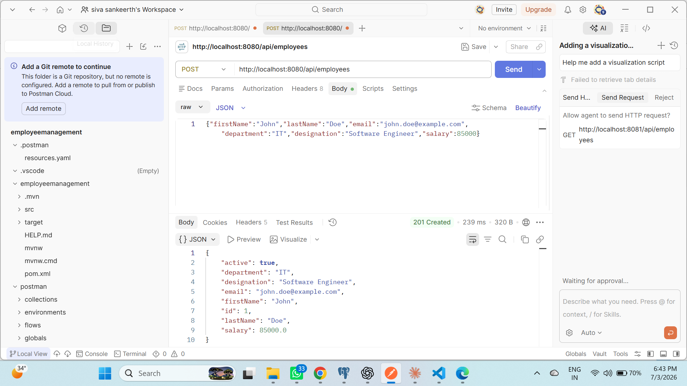
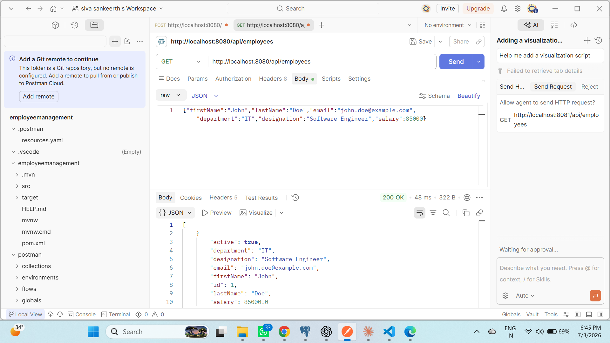
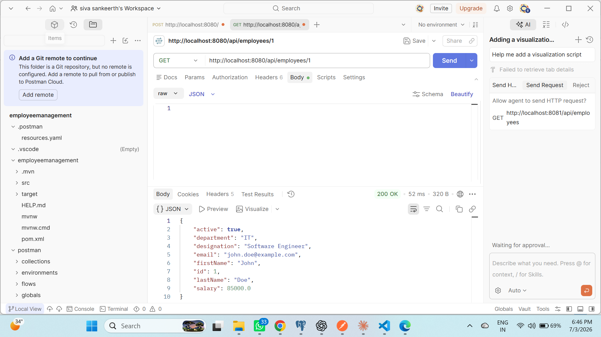
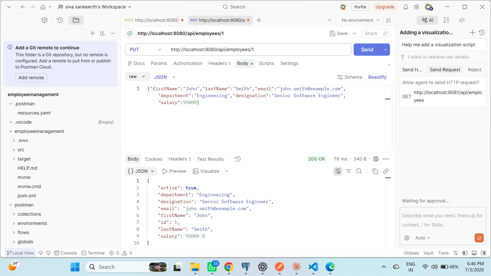
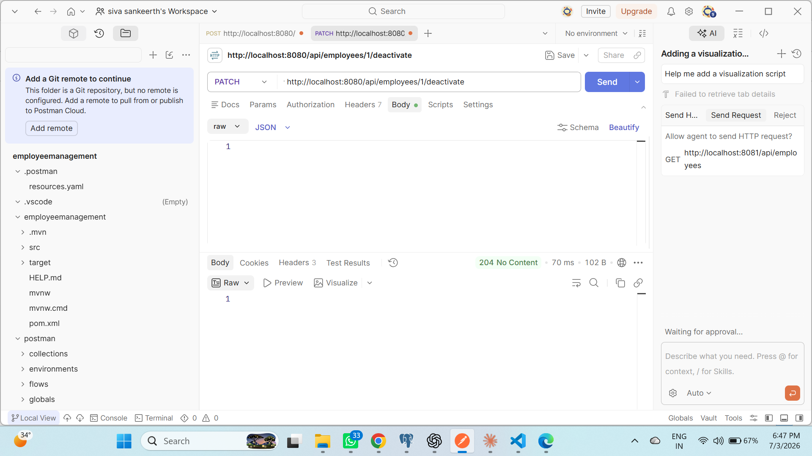
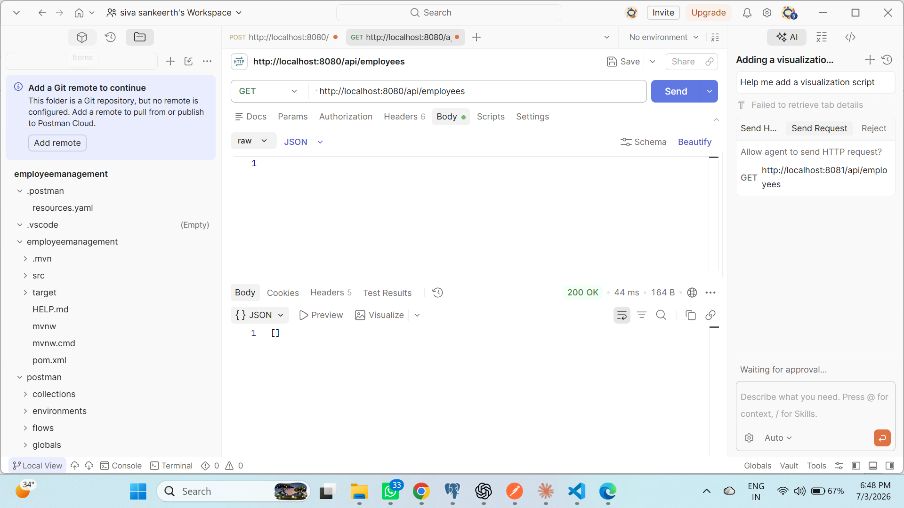
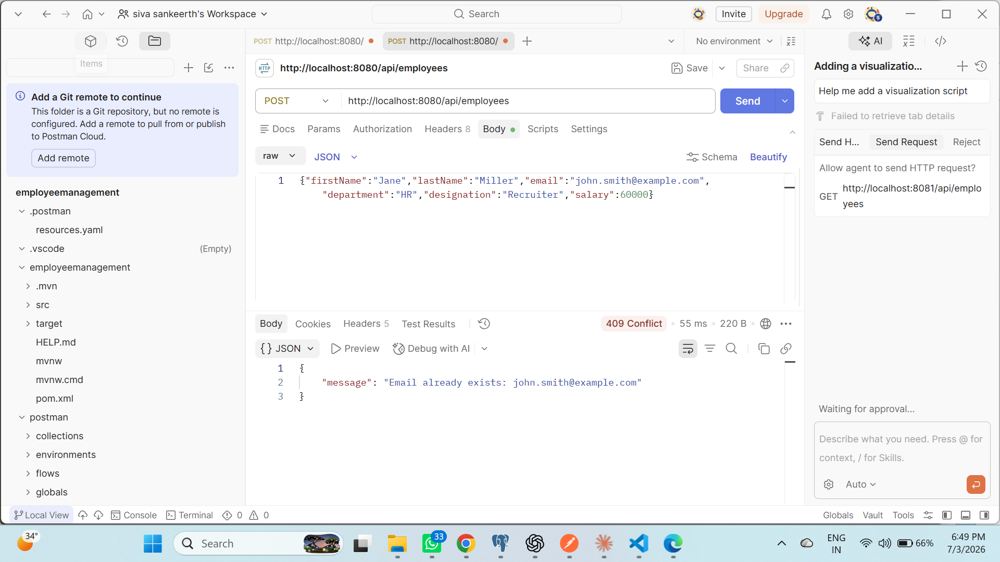
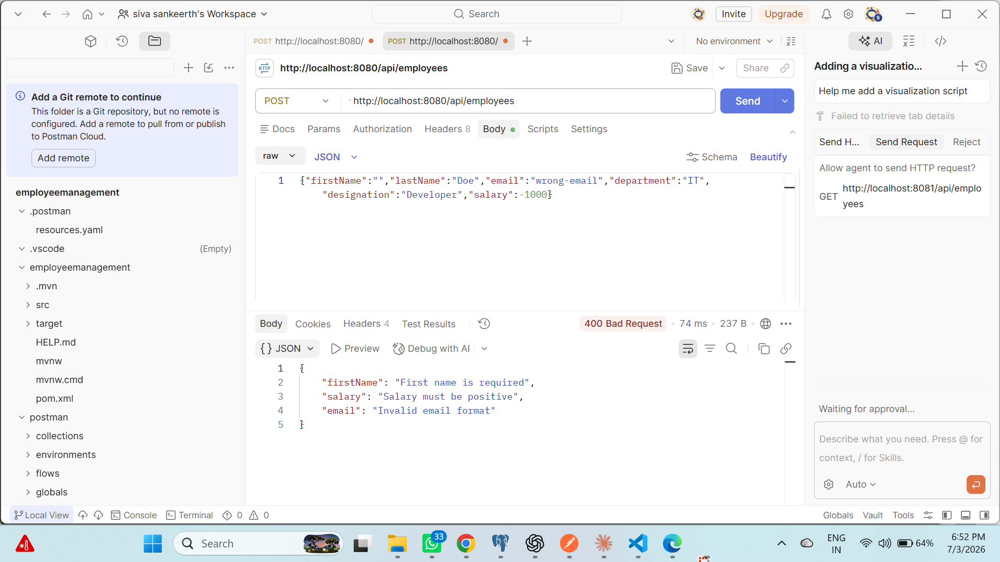
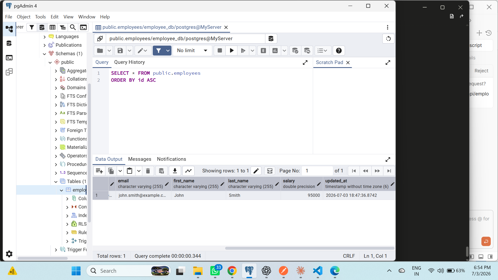

# Employee Management System

A Spring Boot REST API for managing employee records, built with PostgreSQL and layered architecture (Controller → Service → Repository).

## Overview

This is Scenario 1 of a Java Full Stack training assignment. It implements core HR functionality: creating, retrieving, updating, and deactivating employees, with proper validation and error handling.

## Tech Stack

| Layer | Technology |
|---|---|
| Language | Java 17 |
| Framework | Spring Boot |
| Database | PostgreSQL |
| ORM | Spring Data JPA / Hibernate |
| Build Tool | Maven |
| Validation | Jakarta Bean Validation |
| Testing | Postman |

## Features

- Create employee with input validation
- Retrieve all active employees (soft-delete pattern)
- Retrieve employee by ID
- Update employee details
- Deactivate employee (no hard delete)
- Unique email constraint enforced at DB and application level
- Global exception handling with proper HTTP status codes

## Architecture

Controller  → handles HTTP requests
Service     → business logic
Repository  → database access
Entity      → data model
DTO         → request/response contracts
Exception   → centralized error handling


## API Endpoints

| Method | Endpoint | Description | Success | Error Cases |
|---|---|---|---|---|
| POST | `/api/employees` | Create employee | 201 | 400 (validation), 409 (duplicate email) |
| GET | `/api/employees` | List active employees | 200 | — |
| GET | `/api/employees/{id}` | Get employee by ID | 200 | 404 |
| PUT | `/api/employees/{id}` | Update employee | 200 | 400, 404, 409 |
| PATCH | `/api/employees/{id}/deactivate` | Deactivate employee | 204 | 404 |

## Setup

**Prerequisites:** Java 17+, PostgreSQL, Maven (or use included wrapper)

1. Clone the repo
2. Create database:
```sql
   CREATE DATABASE employee_db;
```
3. Update `src/main/resources/application.properties` with your PostgreSQL credentials
4. Run:
```bash
   ./mvnw.cmd spring-boot:run
```
5. API available at `http://localhost:8080`

## Testing

Import `Employee_Management_Postman_Collection.json` into Postman to run the full test suite (create, read, update, deactivate, duplicate-email conflict, validation errors).

## Project Structure

com.example.employeemanagement
├── controller
├── service
├── repository
├── entity
├── dto
└── exception

## Screenshots

### Create Employee — 201 Created


### Get Active Employees — 200 OK


### Get Employee by ID — 200 OK


### Update Employee — 200 OK


### Deactivate Employee — 204 No Content


### Inactive Employee Hidden — 200 OK


### Duplicate Email — 409 Conflict


### Validation Error — 400 Bad Request


### PostgreSQL Employees Table


## Author

Siva Sankeerth .
